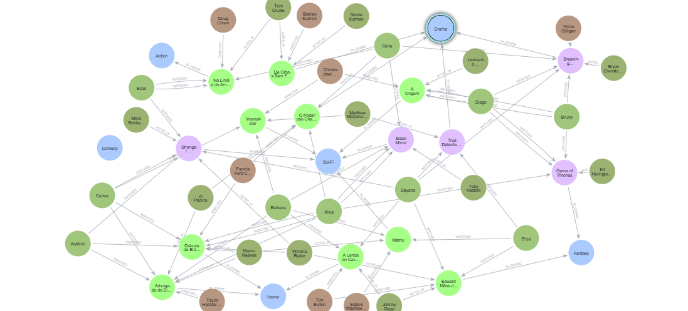

# 🎬 Sistema de Recomendação com Neo4j para Plataforma de Streaming

Um projeto construído como parte do bootcamp Neo4j da DIO, com foco na modelagem de dados em grafos utilizando **Cypher**.  
O objetivo é demonstrar habilidades fundamentais em bancos de grafos, construção de entidades, relacionamentos e aplicação de constraints.

---

## 📌 **Resumo do Projeto**

Este repositório contém:

- **`straming_model.cypher`** – script completo para criação do grafo  
- **`graph.png`** – visualização do grafo  
- **`README.md`** – documentação do projeto  

O grafo modela um pequeno ecossistema de usuários, filmes, séries, atores, diretores e gêneros, simulando um ambiente simples de recomendação.

---

## 🧠 **Entidades Modeladas**

### **User**
Representa usuários que assistem filmes e séries.

### **Movie**
Obras cinematográficas com título, ano e identificador.

### **Series**
Séries com número de temporadas.

### **Actor**
Atores que participam das produções.

### **Director**
Diretores responsáveis pelos títulos.

### **Genre**
Gêneros como Ação, Drama, Comédia e Sci-Fi.

---

## 🔗 **Principais Relacionamentos**

| Relacionamento | De → Para | Descrição |
|----------------|-----------|-----------|
| `IN_GENRE`     | Movie/Series → Genre | Classificação por gênero |
| `ACTED_IN`     | Actor → Movie/Series | Atuações |
| `DIRECTED`     | Director → Movie/Series | Direção |
| `WATCHED`      | User → Movie/Series | Conteúdos assistidos |

---

## 🗂️ **Arquitetura do Repositório**

├── README.md
├── streaming_model.cypher
└── graph.png

---

## 🖼️ **Visualização do Grafo**

A imagem abaixo representa o grafo gerado a partir do script:

---

## 🧾 **Script Completo (streaming_model.cypher)**

> O script de criação do grafo está disponível no arquivo `streaming_model.cypher` e pode ser executado integralmente no Neo4j Browser.

---

## 📚 **Conceitos Praticados**

- Criação de **constraints**  
- Uso de `MERGE`, `CREATE`, `MATCH` e `UNWIND`  
- Geração semi-aleatória de relacionamentos com `rand()`  
- Representação de entidades e suas conexões em um grafo realista  
- Boas práticas de modelagem em Neo4j  

---

📎 **Projeto desenvolvido como parte do Bootcamp Neo4J - Análise de Dados com Grafos da [DIO](https://www.dio.me/)**  
👤 Desenvolvido por: *Elizabeth Thomaz*  
📅 Data: Novembro de 2025  

---

