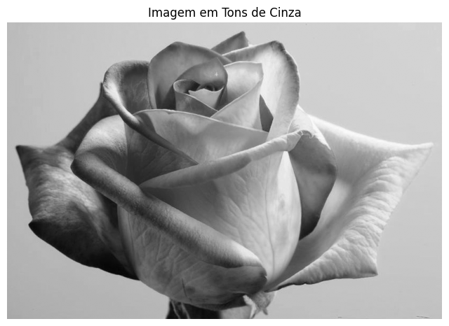

# 🖼️ Redução de Dimensionalidade de Imagens para Redes Neurais

## 📌 Sobre o Projeto

Este projeto foi desenvolvido como parte de um desafio prático da
**Formação Machine Learning Specialist** da [Digital Innovation One
(DIO)](https://www.dio.me/).

O objetivo é implementar, em Python, o processo de transformação de uma
imagem colorida em uma imagem em tons de cinza e, posteriormente, em uma
imagem binarizada em preto e branco.

A implementação das transformações foi realizada manualmente, utilizando
a lógica de processamento de cada pixel da imagem, sem o uso de funções
prontas específicas para conversão de imagens coloridas em tons de cinza
ou para binarização.

---

## 🎯 Objetivos

-   Compreender a representação de imagens digitais por meio de pixels;
-   Trabalhar com os canais de cor RGB;
-   Implementar manualmente a conversão de uma imagem colorida para tons
    de cinza;
-   Implementar manualmente o processo de binarização;
-   Compreender o uso de um limiar (*threshold*) na classificação dos
    pixels;
-   Observar, na prática, a redução da quantidade de informações
    necessárias para representar uma imagem.

---

## 🧠 Conceitos Abordados

### Imagem Colorida --- RGB

Uma imagem colorida é normalmente representada pelo modelo RGB, no qual
cada pixel possui três valores:

-   **R** --- Red (Vermelho);
-   **G** --- Green (Verde);
-   **B** --- Blue (Azul).

Cada canal pode assumir valores entre `0` e `255`.

Assim, um pixel colorido pode ser representado como:

``` text
(R, G, B)
```

Por exemplo:

``` text
(200, 100, 50)
```

---

### Conversão para Tons de Cinza

Para transformar cada pixel colorido em um único valor de intensidade,
foi utilizada a seguinte fórmula ponderada:

``` text
Gray = 0.299R + 0.587G + 0.114B
```

Essa fórmula considera a percepção humana de luminosidade, atribuindo
maior peso ao canal verde, seguido pelos canais vermelho e azul.

Após a conversão, cada pixel passa a ser representado por apenas um
valor entre `0` e `255`:

``` text
0   → preto
255 → branco
```

Dessa forma:

``` text
(R, G, B) → (Gray)
```

---

### Binarização

Na segunda etapa, cada pixel da imagem em tons de cinza é comparado com
um valor de limiar.

Neste projeto, foi utilizado:

``` text
Limiar = 127
```

A regra aplicada foi:

``` text
Se pixel >= 127 → 255 (branco)

Se pixel < 127 → 0 (preto)
```

O resultado é uma imagem que possui somente dois valores possíveis:

``` text
0   → preto
255 → branco
```

---

## 🔄 Fluxo do Processamento

``` text
Imagem Colorida
       │
       ▼
   RGB (R, G, B)
       │
       │ Conversão manual
       ▼
Imagem em Tons de Cinza
       │
       │ Valores entre 0 e 255
       │
       │ Aplicação do limiar
       ▼
Imagem Binarizada
       │
       ▼
     0 ou 255
```

---

## 🧪 Implementação

A conversão para tons de cinza foi realizada percorrendo cada pixel da
imagem e aplicando a fórmula ponderada:

``` python
def converter_para_cinza(imagem):

    largura, altura = imagem.size

    imagem_cinza = Image.new("L", (largura, altura))

    pixels_originais = imagem.load()
    pixels_cinza = imagem_cinza.load()

    for y in range(altura):
        for x in range(largura):

            r, g, b = pixels_originais[x, y]

            valor_cinza = int(
                0.299 * r + 0.587 * g + 0.114 * b
            )

            pixels_cinza[x, y] = valor_cinza

    return imagem_cinza
```

Na sequência, foi implementada a função de binarização:

``` python
def binarizar(imagem_cinza, limiar=127):

    largura, altura = imagem_cinza.size
    imagem_binaria = Image.new("L", (largura, altura))

    pixels_cinza = imagem_cinza.load()
    pixels_binarios = imagem_binaria.load()

    for y in range(altura):
        for x in range(largura):

            valor_pixel = pixels_cinza[x, y]

            if valor_pixel >= limiar:
                pixels_binarios[x, y] = 255
            else:
                pixels_binarios[x, y] = 0

    return imagem_binaria
```

---

## 📊 Resultados

### Imagem Original

A imagem utilizada como entrada foi uma fotografia colorida de uma flor.


---

### Imagem em Tons de Cinza

Após a aplicação da fórmula de conversão, cada pixel passou a ser
representado por um único valor de intensidade entre `0` e `255`.



Na imagem obtida, o menor valor de intensidade encontrado foi `5` e o
maior valor foi `249`.

---

### Imagem Binarizada

Após a aplicação do limiar de `127`, cada pixel foi classificado como
preto ou branco.


A validação dos valores únicos encontrados na imagem binarizada resultou
em:

``` text
{0, 255}
```

Confirmando que a imagem final possui somente pixels pretos e brancos.

---

## 🔬 Análise do Limiar

O limiar foi definido em `127`, um valor aproximadamente central na
escala de intensidade dos pixels da imagem em tons de cinza, que
apresentou valores entre `5` e `249`.

No entanto, esse não é um valor obrigatório, pois o limiar pode ser
ajustado de acordo com as características da imagem e o resultado
desejado.

Ao testar valores de limiar maiores, a imagem apresentou uma maior
quantidade de pixels classificados como pretos. Por outro lado, valores
de limiar menores resultaram em uma maior quantidade de pixels
classificados como brancos.

Portanto, o valor `127` foi utilizado como referência para fins
didáticos. Em aplicações práticas, a escolha do limiar pode depender das
características da imagem e do resultado desejado.

---

## 📉 Redução da Representação da Imagem

O processo realizado pode ser resumido da seguinte forma:

  Representação       Valores por pixel
  ------------------- -----------------------
  Imagem colorida     3 valores: R, G e B
  Tons de cinza       1 valor entre 0 e 255
  Imagem binarizada   1 valor: 0 ou 255

Assim, a imagem passou por uma redução progressiva da quantidade de
informações necessárias para representar cada pixel:

``` text
RGB
(R, G, B)
      ↓
Tons de Cinza
(0 a 255)
      ↓
Binarização
(0 ou 255)
```

---

## 🛠️ Tecnologias Utilizadas

-   Python
-   Google Colab
-   Pillow
-   Matplotlib

---

## 📁 Estrutura do Projeto

``` text
📦 Projeto_Reducao_Dimensionalidade_Imagem
│
├── 📄 README.md
├── 📓 reducao_dimensionalidade_imagem.ipynb
│
└── 📁 images
    ├── 🖼️ flor_binarizada.png
    ├── 🖼️ flor_cinza.png
    ├── 🖼️ flor_colorida.png
    ├── 🖼️ flor_comparacao.png
    └── 🖼️ flor.jpg
```

---

## 🎓 Conclusão

Neste desafio, foi implementado o processo de redução da
dimensionalidade de uma imagem colorida por meio de duas etapas de
transformação.

Inicialmente, a imagem colorida, representada pelo modelo RGB, possuía
três valores associados a cada pixel: vermelho (R), verde (G) e azul
(B). Por meio da aplicação manual de uma fórmula ponderada, esses três
valores foram combinados para gerar um único valor de intensidade entre
0 e 255, resultando em uma imagem em tons de cinza.

Na sequência, foi implementada uma função de binarização utilizando um
valor de limiar. Cada pixel da imagem em tons de cinza foi comparado com
esse limiar e classificado como preto (`0`) ou branco (`255`). Dessa
forma, a imagem final passou a apresentar somente dois valores possíveis
de intensidade.

Também foi possível observar que a escolha do limiar influencia
diretamente o resultado da binarização. Valores de limiar menores tendem
a classificar uma maior quantidade de pixels como brancos, enquanto
valores maiores tendem a classificar uma maior quantidade de pixels como
pretos.

O desenvolvimento deste projeto permitiu compreender, na prática, como
uma imagem pode ter sua representação simplificada, reduzindo a
quantidade de informações necessárias para representar seus pixels. Esse
processo é importante em diversas aplicações de processamento digital de
imagens e visão computacional, podendo contribuir para a preparação de
dados utilizados em sistemas baseados em redes neurais.

---

📎 **Projeto desenvolvido como parte da Formação Machine Learning Specialist [DIO](https://www.dio.me/)**  
👤 Desenvolvido por: *Elizabeth Thomaz*  
📅 Data: Julho de 2026 
🔗 [GitHub](https://github.com/nilatala)


